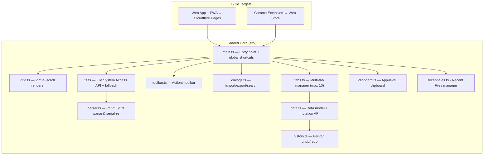

# csvomg — The SVGOMG of CSV Editors

A lean, powerful, single-purpose web tool for editing tabular data. Available as a website, installable PWA, and Chrome extension. Directly edits local files without the download-upload cycle.

## Resolved Design Decisions

Based on your feedback, the following decisions have been locked in:
1. **App Name**: `csvomg` — perfectly captures the lean, focused nature of the tool.
2. **File System Access API**: Approved. We will support direct local file editing (open → edit → Ctrl+S saves back to the same file) with graceful fallback for Firefox/Safari.
3. **Chrome Extension UX**: The extension icon will open `csvomg` in a new tab. For a true "standalone app" experience, we'll rely on the PWA installation, which runs in its own chromeless window and registers as an OS file handler.
4. **Max Tabs & History**: Capped at **10 open tabs** to manage memory. We will implement a "Recent Files" list on the empty state screen tracking previously opened files for quick access.
5. **Auto-save**: Explicit **Ctrl+S** to save is the default. We will add an "Auto-save" toggle in the settings (defaulted to off).

*(Ready for execution upon final user approval).*

---

## Development & Deployment Stack

### Why Vite + TypeScript (No Framework)

| Consideration | Decision | Rationale |
|---|---|---|
| **Bundler** | **Vite** | Instant HMR in dev, Rollup-based production builds with tree-shaking. Perfect for a tool that ships as web + PWA + extension from one codebase. |
| **Language** | **TypeScript** | The data model (undo/redo diffs, multi-tab state, file handles) is complex enough that types catch real bugs. TS compiles away — zero runtime cost. |
| **Framework** | **None** | SVGOMG philosophy — no React, no Svelte, no overhead. The DOM manipulation is concentrated in `grid.ts` (virtual scrolling) where a framework would fight us anyway. TypeScript + Vite gives us modules, imports, and DX without framework weight. |
| **PWA** | **vite-plugin-pwa** | Auto-generates service worker (via Workbox) and `manifest.webmanifest` from config. Handles cache versioning, auto-update, offline. Zero manual SW authoring. |
| **Chrome Extension** | **vite-plugin-web-extension** | Reads `manifest.json` as source of truth, handles multi-entry builds (popup, service worker), outputs correct MV3 structure. |
| **Linting** | **ESLint + typescript-eslint** | Catches errors. No Prettier — use EditorConfig for formatting (leaner). |
| **Testing** | **Vitest** | Same config as Vite. Unit tests for parser, data model, history. No E2E framework needed for V1. |

### Production Bundle Size Target

The entire app (HTML + CSS + JS + fonts) should be **under 100KB gzipped**. For reference, SVGOMG is ~90KB. This is achievable because:
- No framework runtime
- Inline SVG icons (no icon font)
- Google Fonts loaded async with `font-display: swap`
- CSV/JSON parser is ~2KB
- Virtual scroller is ~3KB

---

### Project Structure (with Vite)

```
csvomg/
├── index.html                  # App shell (Vite entry point)
├── vite.config.ts              # Vite config: PWA plugin, build targets
├── tsconfig.json               # TypeScript config
├── package.json                # Scripts, dependencies
├── .editorconfig               # Formatting consistency
│
├── public/
│   ├── icons/
│   │   ├── icon-192.png        # PWA icon
│   │   ├── icon-512.png        # PWA icon
│   │   └── icon-maskable.png   # Maskable PWA icon
│   └── favicon.svg             # Inline SVG favicon
│
├── src/
│   ├── main.ts                 # App entry point, global shortcuts, orchestration
│   ├── style.css               # Complete design system + all styles
│   │
│   ├── core/
│   │   ├── parser.ts           # CSV/JSON parse & serialize
│   │   ├── data.ts             # Data model + mutation API
│   │   ├── history.ts          # Per-tab undo/redo
│   │   ├── clipboard.ts        # App-level + system clipboard bridge
│   │   └── recent-files.ts     # Tracks recently opened files (IndexedDB)
│   │
│   ├── ui/
│   │   ├── grid.ts             # Virtual-scroll grid renderer
│   │   ├── tabs.ts             # Multi-tab manager + tab bar (capped at 10)
│   │   ├── toolbar.ts          # Toolbar UI + actions
│   │   ├── dialogs.ts          # Import/export/search/fill dialogs
│   │   ├── context-menu.ts     # Right-click context menus
│   │   └── status-bar.ts       # Footer status bar (row count, selection)
│   │
│   ├── io/
│   │   └── fs.ts               # File System Access API + fallback + auto-save logic
│   │
│   ├── utils/
│   │   ├── icons.ts            # Inline SVG icon definitions
│   │   ├── shortcuts.ts        # Keyboard shortcut manager
│   │   └── dom.ts              # Tiny DOM helpers (createElement, etc.)
│   │
│   └── types/
│       └── index.ts            # Shared TypeScript interfaces
│
├── extension/                  # Chrome Extension (separate Vite build)
│   ├── manifest.json           # MV3 manifest
│   ├── popup/
│   │   ├── popup.html          # Extension popup
│   │   └── popup.ts            # Popup logic — opens app in new tab
│   └── service-worker.ts       # Extension SW (minimal)
│
└── tests/
    ├── parser.test.ts          # CSV/JSON parsing tests
    ├── data.test.ts            # Data model mutation tests
    └── history.test.ts         # Undo/redo tests
```

---

### Vite Configuration

#### [NEW] [vite.config.ts](file:///Users/nabin/.gemini/antigravity/scratch/csvomg/vite.config.ts)

```ts
import { defineConfig } from 'vite';
import { VitePWA } from 'vite-plugin-pwa';

export default defineConfig({
  plugins: [
    VitePWA({
      registerType: 'autoUpdate',
      manifest: {
        name: 'csvomg',
        short_name: 'csvomg',
        description: 'Lean CSV & JSON editor. Open, edit, save.',
        theme_color: '#131620',
        background_color: '#131620',
        display: 'standalone',
        icons: [
          { src: '/icons/icon-192.png', sizes: '192x192', type: 'image/png' },
          { src: '/icons/icon-512.png', sizes: '512x512', type: 'image/png' },
          { src: '/icons/icon-maskable.png', sizes: '512x512', type: 'image/png', purpose: 'maskable' }
        ],
        file_handlers: [
          {
            action: '/',
            accept: {
              'text/csv': ['.csv', '.tsv'],
              'application/json': ['.json']
            }
          }
        ]
      },
      workbox: {
        globPatterns: ['**/*.{js,css,html,svg,png,woff2}']
      },
      devOptions: { enabled: true }
    })
  ],
  build: {
    target: 'esnext',
    minify: 'esbuild'
  }
});
```

**Chrome Extension build**: Separate `vite.config.extension.ts` using `vite-plugin-web-extension`, built via `npm run build:extension`.

---

### npm Scripts

```jsonc
{
  "scripts": {
    // Development
    "dev":             "vite",                          // Dev server with HMR
    "dev:ext":         "vite build --config vite.config.extension.ts --watch",

    // Production
    "build":           "tsc && vite build",              // Web app + PWA
    "build:extension": "tsc && vite build --config vite.config.extension.ts",
    "build:all":       "npm run build && npm run build:extension",

    // Quality
    "preview":         "vite preview",                   // Preview production build locally
    "test":            "vitest run",                      // Unit tests
    "test:watch":      "vitest",                          // Tests in watch mode
    "lint":            "eslint src/ --ext .ts",
    "typecheck":       "tsc --noEmit",

    // Deployment
    "deploy":          "npm run build && npx wrangler pages deploy dist"  // Cloudflare Pages
  }
}
```

---

### Dependencies

```jsonc
{
  "devDependencies": {
    // Build
    "vite": "^6.x",
    "typescript": "^5.x",

    // PWA
    "vite-plugin-pwa": "^1.x",

    // Chrome Extension
    "vite-plugin-web-extension": "^4.x",

    // Quality
    "vitest": "^3.x",
    "eslint": "^9.x",
    "typescript-eslint": "^8.x",

    // Deployment
    "wrangler": "^4.x"          // Cloudflare CLI (optional, can use GitHub Actions)
  },
  "dependencies": {}              // Zero runtime dependencies 🎯
}
```

> [!TIP]
> **Zero runtime dependencies**. Everything is hand-written: CSV parser, virtual scroller, data model, undo/redo. The `dependencies` field stays empty — only `devDependencies` for build tooling.

---

### Deployment Strategy

#### Web App + PWA → Cloudflare Pages

| Why Cloudflare Pages | Details |
|---|---|
| **Unlimited bandwidth** (free tier) | No risk of site going down if it gets popular |
| **Commercial use allowed** | Free tier permits commercial projects (Vercel Hobby does not) |
| **Global edge network** | Static assets served from 300+ edge locations |
| **GitHub integration** | Auto-deploy on push to `main` |
| **Custom domains** | Free SSL + custom domain on free tier |
| **Zero config** | Detects Vite, runs `npm run build`, serves `dist/` |

**Setup:**
1. Push to GitHub
2. Connect repo to Cloudflare Pages dashboard
3. Build command: `npm run build`
4. Output directory: `dist`
5. Done — auto-deploys on every push to `main`

#### GitHub Actions CI/CD

```yaml
# .github/workflows/deploy.yml
name: Deploy
on:
  push:
    branches: [main]

jobs:
  deploy:
    runs-on: ubuntu-latest
    steps:
      - uses: actions/checkout@v4
      - uses: actions/setup-node@v4
        with: { node-version: 22 }
      - run: npm ci
      - run: npm run typecheck
      - run: npm test
      - run: npm run build
      - uses: cloudflare/wrangler-action@v3
        with:
          command: pages deploy dist --project-name=csvomg
          apiToken: ${{ secrets.CLOUDFLARE_API_TOKEN }}
```

This runs on every push to `main`: typecheck → test → build → deploy. Failures block deployment.

#### Chrome Extension → Chrome Web Store

Publishing workflow:
1. `npm run build:extension` → outputs to `dist-extension/`
2. Zip the output: `cd dist-extension && zip -r ../csvomg-extension.zip .`
3. Upload to [Chrome Developer Dashboard](https://chrome.google.com/webstore/devconsole)
4. Fill in listing metadata (we'll generate a `CHROMEWEBSTORE.md` with the skill)

---

## Architecture Overview



### Key Design Principles (SVGOMG-inspired)

1. **Zero fluff** — Every pixel earns its place. No onboarding, no marketing. Drop a file → you're editing.
2. **Instant feedback** — Edits are immediate. No "apply" buttons. No loading spinners for small files.
3. **Progressive power** — Basic actions are obvious (click to edit). Power features are discoverable (right-click context menus, keyboard shortcuts, toolbar).
4. **Graceful degradation** — Full power on Chrome/Edge. Core editing on Firefox/Safari. Functional on mobile (read + basic edit).

---

## Proposed Changes

### File System Layer & Auto-Save

#### [NEW] [src/io/fs.ts](file:///Users/nabin/.gemini/antigravity/scratch/csvomg/src/io/fs.ts)

Abstraction over file I/O with progressive enhancement:

**Chromium (File System Access API available):**
```
Open file → showOpenFilePicker() → get FileSystemFileHandle
Save (Ctrl+S) → handle.createWritable() → write directly to same file
Save As → showSaveFilePicker() → new handle → write
```
- Retains the `FileSystemFileHandle` per tab so subsequent saves go to the same file.
- **Auto-save Logic**: When the Auto-save setting is toggled on, edits will trigger a debounced write operation to the retained handle.
- Supports `showOpenFilePicker({ multiple: true })` to open multiple files into separate tabs at once.

**Fallback (Firefox/Safari):**
```
Open file → <input type="file"> → FileReader
Save → construct Blob → create download link → click programmatically
```
- No handle retained — each save triggers a download (auto-save is disabled in this mode).

---

### Multi-Tab Manager & Recent Files

#### [NEW] [src/ui/tabs.ts](file:///Users/nabin/.gemini/antigravity/scratch/csvomg/src/ui/tabs.ts)

Each tab is an independent workspace (Capped at 10 tabs maximum):

```ts
interface Tab {
  id: string;                      // unique ID
  title: string;                   // filename or "Untitled 1"
  data: DataModel;                 // from data.ts — owns headers + rows
  history: HistoryManager;         // from history.ts — per-tab undo/redo
  fileHandle: FileSystemFileHandle | null; // from fs.ts
  dirty: boolean;                  // unsaved changes indicator
  scrollPosition: { row: number; col: number };
  selection: Selection | null;
}
```

- If a user tries to open an 11th tab, they will be prompted to close an existing one.

#### [NEW] [src/core/recent-files.ts](file:///Users/nabin/.gemini/antigravity/scratch/csvomg/src/core/recent-files.ts)

- Persists file handles (or file metadata for fallbacks) using IndexedDB.
- Empty state UI will show a list of recently opened files so users can quickly restore sessions.
- In browsers supporting File System Access API, retrieving a handle from IDB may prompt the user to re-grant permission.

---

### Core Data Layer

#### [NEW] [src/core/parser.ts](file:///Users/nabin/.gemini/antigravity/scratch/csvomg/src/core/parser.ts)

RFC 4180 CSV parser + JSON handler, zero dependencies. Auto-detects delimiters.

#### [NEW] [src/core/data.ts](file:///Users/nabin/.gemini/antigravity/scratch/csvomg/src/core/data.ts)

Immutable-style mutations that return undo/redo diffs.

#### [NEW] [src/core/history.ts](file:///Users/nabin/.gemini/antigravity/scratch/csvomg/src/core/history.ts)

Per-tab undo/redo with a 200-action cap.

#### [NEW] [src/core/clipboard.ts](file:///Users/nabin/.gemini/antigravity/scratch/csvomg/src/core/clipboard.ts)

Dual clipboard system for cross-tab and cross-app pasting.

---

### Grid Renderer

#### [NEW] [src/ui/grid.ts](file:///Users/nabin/.gemini/antigravity/scratch/csvomg/src/ui/grid.ts)

Virtual-scrolling spreadsheet grid — lean but powerful.

---

### Toolbar & Dialogs

#### [NEW] [src/ui/toolbar.ts](file:///Users/nabin/.gemini/antigravity/scratch/csvomg/src/ui/toolbar.ts)

Compact, icon-first toolbar (SVGOMG-style — dense but clear):

```
[Open] [Save] [Save As] │ [Undo] [Redo] │ [Add Row ▾] [Add Col ▾] │ [Fill ▾] │ [Search] │ [⚙ Settings]
```

- Settings gear opens a slide-out panel: **Auto-save toggle**, Theme toggle, delimiter preference.

#### [NEW] [src/ui/dialogs.ts](file:///Users/nabin/.gemini/antigravity/scratch/csvomg/src/ui/dialogs.ts)

Native `<dialog>` elements for Import, Export, Search, Fill Pattern, and Unsaved Changes confirmations.

---

### Design System

#### [NEW] [src/style.css](file:///Users/nabin/.gemini/antigravity/scratch/csvomg/src/style.css)

SVGOMG-inspired aesthetic — dark, dense, professional.

---

### Entry Point

#### [NEW] [index.html](file:///Users/nabin/.gemini/antigravity/scratch/csvomg/index.html)

#### [NEW] [src/main.ts](file:///Users/nabin/.gemini/antigravity/scratch/csvomg/src/main.ts)

Orchestrator — wires all modules, global shortcuts, empty state drop zone (now showing Recent Files), `launchQueue` integration for PWA file handler, `beforeunload` guard for dirty tabs.

---

### Chrome Extension

#### [NEW] [extension/manifest.json](file:///Users/nabin/.gemini/antigravity/scratch/csvomg/extension/manifest.json)

Manifest V3 wrapper. Bundles the entire web app inside the extension.

#### [NEW] [extension/popup/popup.html](file:///Users/nabin/.gemini/antigravity/scratch/csvomg/extension/popup/popup.html) + [popup.ts](file:///Users/nabin/.gemini/antigravity/scratch/csvomg/extension/popup/popup.ts)

Minimal popup: "Open csvomg" button + "Open File..." button.

#### [NEW] [extension/service-worker.ts](file:///Users/nabin/.gemini/antigravity/scratch/csvomg/extension/service-worker.ts)

Minimal — handles tab creation from popup.

---

## Keyboard Shortcuts

| Shortcut | Action |
|---|---|
| `Arrow keys` | Move selection |
| `Tab` / `Shift+Tab` | Move right / left |
| `Enter` / `F2` | Edit cell / move down |
| `Escape` | Cancel edit / deselect |
| `Ctrl+Z` / `Ctrl+Shift+Z` | Undo / Redo |
| `Ctrl+F` | Find & Replace |
| `Ctrl+C` / `Ctrl+V` / `Ctrl+X` | Copy / Paste / Cut |
| `Ctrl+D` | Fill down |
| `Ctrl+S` | Save (direct or download) |
| `Ctrl+Shift+S` | Save As |
| `Ctrl+O` | Open file(s) |
| `Ctrl+N` | New empty tab |
| `Ctrl+W` | Close current tab |
| `Ctrl+Tab` / `Ctrl+Shift+Tab` | Next / Previous tab |
| `Delete` / `Backspace` | Clear selected cells |
| `Ctrl+A` | Select all |

---

## Implementation Order

### Phase 1: Project Setup + Core Grid
1. `npm create vite` + configure TS, ESLint, Vitest
2. `src/style.css` — design system (colors, typography, grid styles)
3. `src/core/parser.ts` + tests — CSV/JSON parsing
4. `src/core/data.ts` + tests — data model with mutations
5. `src/ui/grid.ts` — virtual-scroll grid with cell editing
6. `src/io/fs.ts` — file open/save with File System Access API
7. `src/main.ts` — wire it up, keyboard shortcuts, empty state

**Milestone**: Open a CSV, edit cells, Ctrl+S saves back. Single file.

### Phase 2: Multi-Tab + Clipboard + Undo + Recent Files
8. `src/core/history.ts` + tests — per-tab undo/redo
9. `src/ui/tabs.ts` — tab manager (capped at 10)
10. `src/core/clipboard.ts` — cross-tab copy/paste
11. `src/core/recent-files.ts` — Track recent files and display in empty state

**Milestone**: Multiple files in tabs, cross-tab paste, undo/redo, recent files tracking.

### Phase 3: Full Feature Set
12. `src/utils/icons.ts` — SVG icon set
13. `src/ui/toolbar.ts` — toolbar with all actions and settings (Auto-save toggle)
14. `src/ui/dialogs.ts` — import/export/search/fill dialogs
15. `src/ui/context-menu.ts` — right-click context menus
16. Row operations (add, delete, duplicate)
17. Column operations (add, rename, delete, reorder, resize)
18. Fill Down + Fill Pattern
19. Sort by column
20. Find & Replace
21. `src/ui/status-bar.ts` — row count, selection info

**Milestone**: Feature-complete editor.

### Phase 4: PWA + Extension + Deploy
22. Configure `vite-plugin-pwa` — manifest, service worker, icons
23. PWA file handler (`launchQueue` integration)
24. `extension/` — Chrome Extension with `vite-plugin-web-extension`
25. GitHub Actions CI/CD pipeline
26. Deploy to Cloudflare Pages
27. Chrome Web Store listing prep (`CHROMEWEBSTORE.md`)

**Milestone**: Live on web, installable as PWA, loadable as extension.

### Phase 5: Polish
28. Light mode theme
29. Responsive layout refinement
30. Accessibility audit (keyboard nav, ARIA)
31. Performance testing with 100k-row files
32. Error handling + edge cases (malformed CSV, huge cells, etc.)

---

## Verification Plan

### Automated Tests (Vitest)
```bash
npm test
```
- `parser.test.ts` — CSV with various delimiters, quoted fields, JSON array-of-objects + array-of-arrays
- `data.test.ts` — all mutation methods, edge cases (empty data, single row, etc.)
- `history.test.ts` — undo/redo stack, batch operations, cap enforcement

### Manual Verification
1. **Dev server**: `npm run dev` → verify HMR, no console errors
2. **Import/Export**: CSV (comma, tab, semicolon, pipe) + JSON
3. **Direct save**: Ctrl+S on Chrome (verify file updated on disk)
4. **Fallback save**: Firefox (verify download triggers)
5. **Multi-tab & Limits**: Open 10 files, try opening 11th, close with unsaved changes.
6. **Recent Files**: Close and reopen app, verify recent files list loads previously edited files.
7. **Auto-save**: Toggle auto-save in settings, make edits, wait for debounce, verify file updated on disk automatically.
8. **Cross-tab paste**: Copy rows from tab A → paste in tab B
9. **All operations**: Cell edit, row add/delete, column rename/reorder, fill, sort, find/replace
10. **Undo/Redo**: All ops reversible, per-tab isolation
11. **Keyboard shortcuts**: Full table above
12. **PWA install**: Chrome → Install → verify file handler registration
13. **PWA offline**: Disconnect → verify app still works
14. **Extension**: Load unpacked → verify popup → verify app opens
15. **Large file**: 100k-row CSV → verify virtual scroll performance (<16ms frames)
16. **Production build**: `npm run build` → `npm run preview` → verify bundle size < 100KB gzip
17. **Deploy**: Push to `main` → verify Cloudflare Pages auto-deploys
